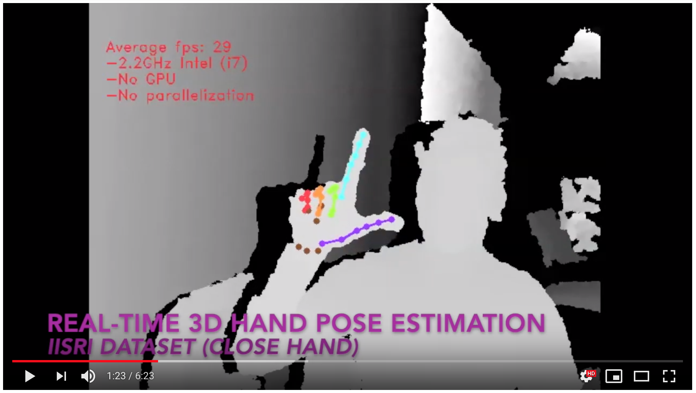

Code for our BMVC oral paper (4.3% acceptance rate): "3D Hand Pose Estimation using Simulation and Partial-Supervision with a Shared Latent Space"  see the paper at https://arxiv.org/abs/1807.05380

### Citation

If you found this research useful, please cite:

@article{abdi20183d,
title={3D Hand Pose Estimation using Simulation and Partial-Supervision with a Shared Latent Space},
author={Abdi, Masoud and Abbasnejad, Ehsan and Lim, Chee Peng and Nahavandi, Saeid},
journal={arXiv preprint arXiv:1807.05380},
year={2018}
}


## Supplementary Video:
### Real-time 3d hand pose estimation on CPU
[](https://youtu.be/Hjkob3dV-kY)


## Discriminative Results:


## Generative Results:


#  Usage
1. Use pose_train to train the vae: 
```
python depth_train.py --config ../exps/nnyu.yaml
```

2. Pretrain the depth model using: 
```
python depth_train.py --config ../exps/nnyu.yaml --mode pretrain
```

3. Finally run this command for the unsupervised setting: 
```
python depth_train.py --config ../exps/nnyu.yaml --mode estimate3
```


